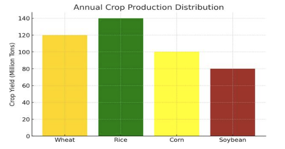
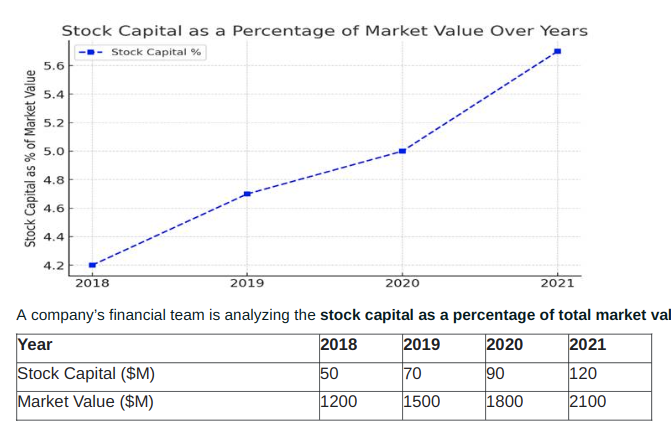

### Question 1  
If the company's total revenue for the year was $500 million, how much revenue did Product B generate? (Product B 25% Revenue)
- a. $125 million  
- b. $100 million  
- c. $150 million  
- d. $175 million  

---

### Question 2  
How many enqueue/dequeue operations are required to support the following sequence of stack operations?  
```
push(10)
push(20)
pop()
push(30)
push(40)
pop()
```
- a. 7 enqueue 6 dequeue  
- b. 8 enqueue 5 dequeue  
- c. 7 enqueue 5 dequeue  
- d. 8 enqueue 6 dequeue  


---

### Question 3  


If a drought affected Corn production reducing its yield by 20%, what would be the new production value for Corn?  
- a. 90 million tons  
- b. 110 million tons  
- c. 80 million tons  
- d. 100 million tons   

---

### Question 4  
Three players, \( X \), \( Y \), and \( Z \), participated in a football league. The ratio of the number of goals by \( X \) to \( Y \) and the ratio of the number of goals by \( Y \) to \( Z \) is each 4:3. They scored a total of 400 goals in the season. How many goals did Player \( X \) score?  
- a. 144  
- b. 172  
- c. 160  
- d. 128  


---

### Question 5  

In which year was the stock capital as a percentage of market value the highest?  
- a. 2021  
- b. 2020  
- c. 2018  
- d. 2019  

